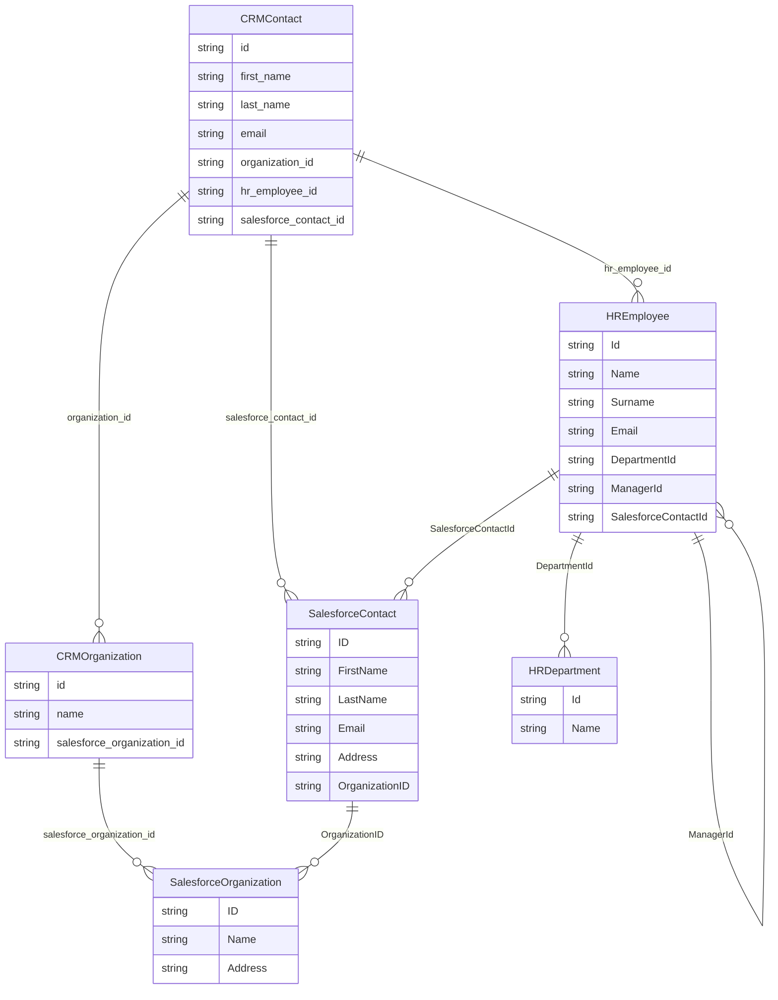

# Fake

Scripts to generate fake data for testing purposes.

```mermaid
erDiagram
    CRMContact {
        string id
        string first_name
        string last_name
        string email
        string organization_id
        string hr_employee_id
        string salesforce_contact_id
    }
    CRMContact ||--o{ CRMOrganization : "organization_id"
    CRMContact ||--o{ HREmployee : "hr_employee_id"
    CRMContact ||--o{ SalesforceContact : "salesforce_contact_id"
    
    CRMOrganization {
        string id
        string name
        string salesforce_organization_id
    }
    CRMOrganization ||--o{ SalesforceOrganization : "salesforce_organization_id"
    
    HRDepartment {
        string Id
        string Name
    }
    
    HREmployee {
        string Id
        string Name
        string Surname
        string Email
        string DepartmentId
        string ManagerId
        string SalesforceContactId
    }
    HREmployee ||--o{ HRDepartment : "DepartmentId"
    HREmployee ||--o{ HREmployee : "ManagerId"
    HREmployee ||--o{ SalesforceContact : "SalesforceContactId"
    
    SalesforceContact {
        string ID
        string FirstName
        string LastName
        string Email
        string Address
        string OrganizationID
    }
    SalesforceContact ||--o{ SalesforceOrganization : "OrganizationID"
    
    SalesforceOrganization {
        string ID
        string Name
        string Address
    }
    
```
